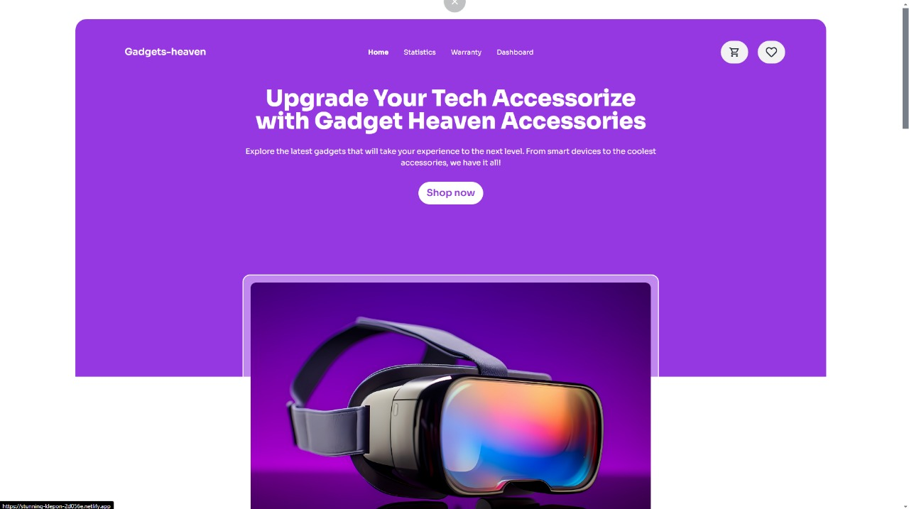

# Gadget Havens

## Project Overview

🎮 **Gadget Havens** is a React-based eCommerce website designed for gadget enthusiasts! It offers a smooth shopping experience where users can browse gadgets, like products, and easily add them to their cart 🛒. Plus, users can search gadgets by category for easier navigation. The website is fully responsive, making it easy to shop on both desktop 💻 and mobile 📱.

## Live Website

🔗 Explore the live website here: [Gadget Havens Live](https://stunning-klepon-2d056e.netlify.app/)

## Technologies Used

- ⚛️ **React**
- 💾 **Local Storage** for data persistence
- 🌐 **HTML5**, **CSS3**, **JavaScript**

## README File

### 1. Project Overview

**Gadget Havens** is a sleek eCommerce site built with **React**, offering gadget lovers a chance to discover, like, and purchase their favorite products 💡. With user-friendly features and a responsive design, this website makes online shopping fun and efficient 🏃‍♂️.

### 2. Screenshot

<div align="center">

</div>
### 3. Main Technologies Used

- ⚛️ **React**: For building the user interface with components and hooks.
- 💾 **Local Storage**: To store user data like liked products and cart items.
- 🎨 **CSS3**: For styling the UI and creating a responsive design.

### 4. Core Features

- ❤️ **Like Product Cards**: Users can "like" product cards to show interest.
- 🛒 **Add to Cart**: Easily add gadgets to the shopping cart.
- 🌟 **Beautiful Toasts**: Toast notifications for actions like adding to cart or liking a product.
- 🔍 **Category-Based Search**: Easily search for gadgets by category.
- 📱 **Responsive Design**: Fully optimized for both desktop and mobile devices.

### 5. Dependencies Used

- ⚛️ `react`: The core library used to build the project.
- 🍞 `react-toastify`: For showing toast notifications.
- 🚀 `react-router-dom`: For managing navigation within the app.

### 6. How to Run the Project Locally

To run this project locally, follow these steps:

1. Clone the repository:
   ```bash
   git clone https://github.com/tahmidjihan/gadget-havens.git
   ```

2. Navigate to the project directory:
   ```bash
   cd gadget-havens
   ```

3. Install the dependencies:
   ```bash
   npm install
   ```

4. Start the development server:
   ```bash
   npm start
   ```

5. Open the app in your browser:
   Go to `http://localhost:3000` to view the project.

### 7. Live Project Link

- 🌐 **Live Website**: [Gadget Havens Live](https://stunning-klepon-2d056e.netlify.app/)
